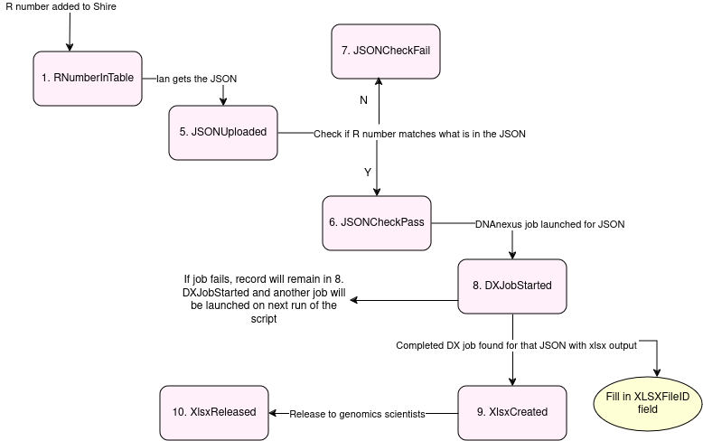

# rd_wgs_workbooks_monitoring

> [!WARNING]  
> Shire is a live database, so be careful when running!

## What does this script do?
rd_wgs_workbooks_monitor.py is a script that runs on the Ida server. It uses the information in the Shire CIPAPIReferralNumber table (the GEL R numbers and RD WGS GEL JSON file IDs) check the RD WGS JSON files on DNAnexus have the correct case R number, and if so, launch [eggd_generate_rd_wgs_workbook](https://github.com/eastgenomics/eggd_generate_rd_wgs_workbook) DNAnexus jobs, and record the output xlsx file ID in Shire.

A map of the process is shown below:



**Inputs (required)**:
* `--dx_token`: DNAnexus token
* `--config`: JSON config for monitor. Should be most recent release. See [rd_wgs_workbook_monitor_config](https://github.com/eastgenomics/rd_wgs_workbook_monitor_config) for more details

**Inputs (optional)**:
* `--testing`: if specified, will run first 5 records in database only.
* `--download_path`: if specified, will download workbooks to the specified path


## Example command to run
```
python3 rd_wgs_workbooks_monitor.py --dx_token <token>
--config /appdata/configs/rd_wgs_workbooks/rd_wgs_workbook_monitor_config_1.0.0.json
--download_path "/appdata/clingen/cg/Regional Genetics Laboratories/Molecular Genetics/Data archive/Sequencing HT/WGS_automated/"
```
